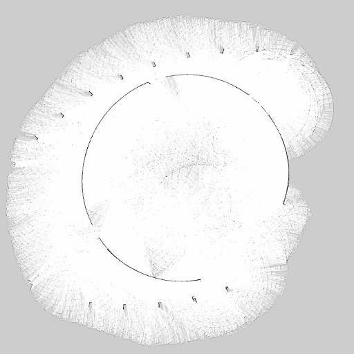

# Olin O Virtual Simulation

Fundamentals of Robotics 2016-2017

Virtual environment and template 4-wheeled robot

For software testing purposes.

# Demo Video

[Youtube Link](https://youtu.be/Hh-CCqRdo3Q)

# Installation

Requires a maximum storage space of 680 MB available.

(tested in a bare chroot environment)

```bash
cd ~/catkin_ws/src/
git clone https://github.com/yycho0108/olin_funrobo.git
cd ~/catkin_ws
catkin_make
rosdep install -y olin_control olin_description olin_gazebo
```

# Launching

```bash
roslaunch olin_gazebo all.launch
```

# Generating a map

## Launching the simulation

```bash
roslaunch olin_gazebo all.launch build_map:=true
```

## Navigate around the world

After launching the simulation, navigate around the world(rviz will visualize your progress).

You can control the robot with arrow keys.

## Saving the Map

When you have sufficiently built the map, save the map:

```bash
rosrun map_server map_saver
```

## Seeing the Map

The map file is saved as pgm, which may not be linked to an application by default.

I'm sure there are other options, but gimp supports .pgm files.

```bash
gimp map.pgm
```

## Example Map(as of 08/16/16):



There aren't much obstacles around, and the lidar is placed too high in order to support full detection.

